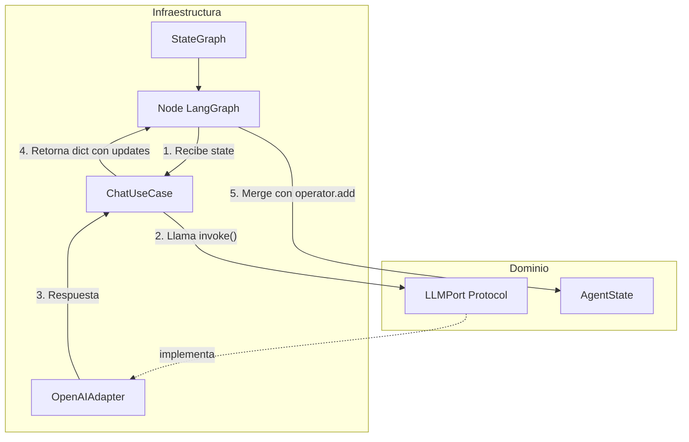

# Plan: Scaffold py-hexagonal-langgraph

## 1. Árbol de directorios completo

```
py-hexagonal-langgraph/
├── pyproject.toml
├── README.md
├── .env.example
├── .gitignore
│
├── src/
│   └── py_hexagonal_langgraph/
│       ├── __init__.py
│       │
│       ├── domain/
│       │   ├── __init__.py
│       │   ├── models/
│       │   │   ├── __init__.py
│       │   │   ├── agent_state.py      # AgentState con Annotated + operator.add
│       │   │   └── entities.py         # Entidades puras (ej. Message, ToolResult)
│       │   └── ports/
│       │       ├── __init__.py
│       │       ├── llm_port.py         # Protocol para invocar LLMs
│       │       └── repository_port.py  # Protocol para persistencia
│       │
│       ├── application/
│       │   ├── __init__.py
│       │   ├── use_cases/
│       │   │   ├── __init__.py
│       │   │   └── chat_use_case.py    # Orquesta: recibe estado, llama puerto LLM, devuelve actualización
│       │   └── services/
│       │       ├── __init__.py
│       │       └── prompt_service.py   # Lógica compartida para prompts
│       │
│       ├── infrastructure/
│       │   ├── __init__.py
│       │   ├── graph/
│       │   │   ├── __init__.py
│       │   │   ├── builder.py          # Construye StateGraph con nodos y aristas
│       │   │   └── nodes.py            # Definición de nodos que invocan use cases
│       │   ├── adapters/
│       │   │   ├── __init__.py
│       │   │   ├── openai_adapter.py   # Implementa LLMPort con OpenAI
│       │   │   ├── mock_llm_adapter.py # Implementa LLMPort para tests (respuestas fijas)
│       │   │   └── postgres_repository.py  # Implementa RepositoryPort
│       │   ├── api/
│       │   │   ├── __init__.py
│       │   │   ├── app.py              # FastAPI app y router
│       │   │   └── schemas.py          # Pydantic request/response
│       │   └── config/
│       │       ├── __init__.py
│       │       └── settings.py          # pydantic-settings BaseSettings
│       │
│       └── prompts/
│           └── system_prompt.txt       # Plantillas desacopladas
│
├── tests/
│   ├── __init__.py
│   ├── conftest.py                     # Fixtures: mock adapters, graph compilado
│   ├── unit/
│   │   ├── __init__.py
│   │   ├── domain/
│   │   │   └── test_agent_state.py
│   │   └── application/
│   │       └── test_chat_use_case.py
│   └── integration/
│       ├── __init__.py
│       ├── test_graph_execution.py     # Grafo con MockLLMAdapter
│       └── test_api_endpoints.py       # TestClient de FastAPI
│
└── scripts/
    └── run_dev.sh                      # Ejecuta uvicorn (opcional)
```

---

## 2. Flujo: Nodo LangGraph → Puerto del Dominio




**Secuencia concreta:**

1. **Nodo** (`nodes.py`): Recibe `state: AgentState`, extrae `messages` y contexto.
2. **Inyección**: El nodo recibe el `ChatUseCase` por closure o parámetro (inyectado al construir el grafo).
3. **Use Case**: `ChatUseCase.invoke(state)` llama a `self.llm_port.generate(messages, system_prompt)`.
4. **Puerto**: `LLMPort` es un `Protocol`; el adaptador concreto (OpenAI o Mock) está inyectado.
5. **Retorno**: El use case devuelve `{"messages": [nuevo_mensaje]}`; LangGraph aplica `operator.add` al campo `messages` del estado.

**Regla de oro**: El nodo nunca importa `openai` ni `langchain`. Solo conoce `LLMPort` y `ChatUseCase`.

---

## 3. Configuración clave de pyproject.toml

### Dependencias principales

```toml
[project]
name = "py-hexagonal-langgraph"
version = "0.1.0"
requires-python = ">=3.11"
dependencies = [
    "fastapi>=0.115.0",
    "uvicorn[standard]>=0.32.0",
    "langgraph>=0.2.0",
    "langchain-openai>=0.2.0",
    "langchain-core>=0.3.0",
    "pydantic>=2.0",
    "pydantic-settings>=2.0",
]

[project.optional-dependencies]
dev = [
    "pytest>=8.0",
    "pytest-asyncio>=0.24.0",
    "ruff>=0.8.0",
    "mypy>=1.13.0",
]
```

### Ruff (linting y formateo)

```toml
[tool.ruff]
target-version = "py311"
line-length = 100

[tool.ruff.lint]
select = [
    "E",      # pycodestyle errors
    "W",      # pycodestyle warnings
    "F",      # Pyflakes
    "I",      # isort
    "N",      # pep8-naming
    "UP",     # pyupgrade
    "B",      # flake8-bugbear
    "C4",     # flake8-comprehensions
    "SIM",    # flake8-simplify
    "TCH",    # flake8-type-checking
]
ignore = ["E501"]  # line-length manejado por formatter

[tool.ruff.format]
quote-style = "double"
```

### Mypy (análisis estático estricto)

```toml
[tool.mypy]
python_version = "3.11"
strict = true
warn_return_any = true
warn_unused_configs = true
disallow_untyped_defs = true

[[tool.mypy.overrides]]
module = "tests.*"
strict = true
```

### Pytest

```toml
[tool.pytest.ini_options]
testpaths = ["tests"]
asyncio_mode = "auto"
addopts = "-v --tb=short"
```

---

## 4. Estrategia para probar el grafo sin llamar a OpenAI

### Enfoque: Mock del Puerto, no del HTTP

| Capa                        | Estrategia                                                                                         |
| --------------------------- | -------------------------------------------------------------------------------------------------- |
| **Dominio**                 | Tests unitarios puros: `AgentState`, entidades, lógica de merge. Sin mocks.                        |
| **Application**             | Mock de `LLMPort`: crear `MockLLMAdapter` que devuelve respuestas fijas.                           |
| **Infraestructura (grafo)** | Usar `MockLLMAdapter` inyectado al compilar el grafo. Ejecutar `graph.invoke()` sin tokens reales. |
| **API**                     | `TestClient` de FastAPI; el grafo inyectado con `MockLLMAdapter` en tests.                         |

### Implementación de MockLLMAdapter

- Implementa `LLMPort` (Protocol).
- Método `generate(messages, system_prompt) -> list[Message]` retorna una lista fija, p.ej. `[AIMessage(content="respuesta de prueba")]`.
- Opcional: aceptar un `responses: list[str]` en el constructor para simular múltiples turnos.

### Patrón de test del grafo

```python
# tests/integration/test_graph_execution.py
def test_graph_invocation_returns_expected_state():
    mock_llm = MockLLMAdapter(responses=["Hola, soy el asistente"])
    graph = build_graph(llm_adapter=mock_llm)  # DI en el builder
    compiled = graph.compile(checkpointer=MemorySaver())

    result = compiled.invoke(
        {"messages": [HumanMessage(content="Hola")]},
        config={"configurable": {"thread_id": "test-1"}}
    )

    assert len(result["messages"]) == 2  # Human + AI
    assert result["messages"][-1].content == "Hola, soy el asistente"
```

### Tests de nodos individuales (LangGraph oficial)

- Acceder a `compiled_graph.nodes["agent_node"]` e invocar solo ese nodo con estado preparado.
- Útil para probar ramas condicionales sin ejecutar todo el flujo.

---

## 5. Comandos para instalar dependencias (modo Agent)

Una vez aprobado el plan y en modo Agent, ejecutar:

```bash
# Opción A: Con uv (recomendado, más rápido)
uv venv
source .venv/bin/activate  # En Windows: .venv\Scripts\activate
uv pip install -e ".[dev]"

# Opción B: Con pip estándar
python -m venv .venv
source .venv/bin/activate
pip install -e ".[dev]"
```

**Verificación de calidad:**

```bash
ruff check src tests
ruff format src tests --check
mypy src
pytest tests -v
```

---

## 6. Consideración: Dominio puro y LangGraph

**Problema**: LangGraph usa `BaseMessage` de `langchain_core` en su `StateGraph`. Si el dominio define sus propios tipos de mensaje, habrá una capa de adaptación.

**Solución propuesta**:

- En `domain/models/`: definir `DomainMessage` (dataclass con `role`, `content`) y `AgentState` con `messages: Annotated[list[DomainMessage], operator.add]`.
- En `infrastructure/adapters/`: el `OpenAIAdapter` convierte `DomainMessage` ↔ `BaseMessage` en los límites.
- En `infrastructure/graph/`: el builder crea un `TypedDict` compatible con LangGraph que use `BaseMessage` internamente, pero los use cases trabajan solo con `DomainMessage`. La conversión ocurre en los nodos (capa de infraestructura).

Alternativa más simple: si se acepta que el dominio use `BaseMessage` como tipo "estándar" de mensaje, se viola la pureza del dominio. La opción recomendada es mantener tipos propios en dominio y adaptar en los bordes.

---

## Resumen de decisiones clave

| Aspecto                   | Decisión                                                                             |
| ------------------------- | ------------------------------------------------------------------------------------ |
| Pureza del dominio        | Tipos propios (`DomainMessage`, `AgentState`); conversión en adapters                |
| Inyección de dependencias | Constructor del use case recibe `LLMPort`; el builder del grafo inyecta el adaptador |
| Prompts                   | Archivos `.txt` en `prompts/`, cargados por `PromptService`                          |
| Testing del grafo         | `MockLLMAdapter` inyectado; `MemorySaver` para checkpointer; sin llamadas HTTP       |
| Linting                   | Ruff (select estricto) + Mypy (strict=true)                                          |
